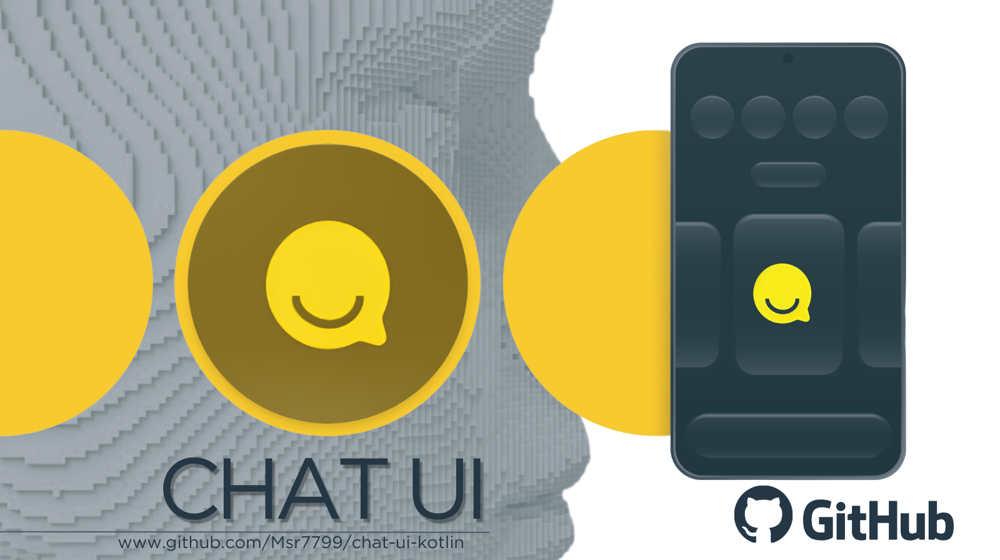

# Chat UI Go Backend

<p align="center">
  
</p>

<p align="center">
  <b>A modern Android AI chat application built with Kotlin, Jetpack Compose, Firebase, Cloudinary, and a secure Go backend.</b>
</p>

<p align="center">
  
  
  
  
  
  
  
  
</p>

---

## Overview

**Chat UI** is a professional Android AI chat application designed for clean conversations, secure authentication, cloud media handling, and server-side AI routing.

The application is built with **Kotlin** and **Jetpack Compose** for a modern native Android experience. It integrates with **Firebase** for authentication and user data, **Cloudinary** for media uploads, and a secure **Go backend** deployed on cloud infrastructure.

The main goal of this project is to keep sensitive API keys away from the Android APK. The Android app authenticates users with Firebase, then communicates with the backend using a Firebase ID token. The backend securely handles AI providers, Cloudinary uploads, Tavily MCP, and Google AI Studio requests.

---

## Features

- Modern Android UI built with **Jetpack Compose**
- Secure Firebase Authentication
- AI chat support through a protected backend
- Streaming chat response support
- File-based chat support for PDF analysis
- Cloudinary image and video upload support
- Google AI Studio proxy support
- Tavily MCP proxy support
- Firebase usage tracking
- Backend-side API key protection
- Cloud-ready deployment with Google Cloud Run or Render
- Clean architecture suitable for production expansion

---

## Tech Stack

| Layer | Technology |
| --- | --- |
| Android Language | Kotlin |
| UI Toolkit | Jetpack Compose |
| Authentication | Firebase Auth |
| Database / Usage Tracking | Firestore |
| Media Storage | Cloudinary |
| Backend | Go |
| AI Router | Hugging Face Router |
| Google AI | Google AI Studio / Gemini |
| MCP Search | Tavily MCP |
| Deployment | Google Cloud Run / Render |
| Version Control | GitHub |

---

## Architecture

```text
Android App
   |
   | Firebase ID Token
   v
Go Backend API
   |
   |-- Hugging Face Router
   |-- Google AI Studio
   |-- Tavily MCP
   |-- Cloudinary Upload
   |-- Firestore Usage Tracking
```

The Android app does not call Hugging Face, Google AI Studio, Tavily, or Cloudinary secrets directly.

Instead, the app sends a Firebase ID token to the backend:

```http
Authorization: Bearer <Firebase ID Token>
```

The backend validates the user and safely attaches the required server-side API keys.

---

## Backend API

The project uses a secure Go backend with the following main endpoints:

| Method | Endpoint | Description |
| --- | --- | --- |
| `GET` | `/healthz` | Public health check |
| `GET` | `/v1/models` | Get available AI models |
| `POST` | `/v1/chat` | Send normal chat request |
| `POST` | `/v1/chat/stream` | Send streaming chat request |
| `POST` | `/v1/chat/with-file` | Upload and analyze PDF file |
| `GET` / `POST` | `/v1/google/*` | Proxy Google AI Studio requests |
| `POST` | `/v1/mcp/tavily` | Proxy Tavily MCP requests |
| `POST` | `/v1/cloudinary/upload` | Upload image/video to Cloudinary |

---

## Security Model

This project is designed to avoid exposing sensitive API keys inside the Android application.

Protected secrets stay only on the backend:

```env
HF_API_KEY=
GOOGLE_STUDIO_API_KEY=
TAVILY_API_KEY=
CLOUDINARY_CLOUD_NAME=
CLOUDINARY_API_KEY=
CLOUDINARY_API_SECRET=
FIREBASE_PROJECT_ID=
```

The APK should never contain:

- Hugging Face API keys
- Google AI Studio keys
- Tavily API keys
- Cloudinary API secrets
- Service account JSON files

---

## Android Configuration

For local emulator testing, use:

```env
BACKEND_BASE_URL=http://10.0.2.2:8080/v1
```

For production, use your deployed backend URL:

```env
BACKEND_BASE_URL=https://your-backend.example.com/v1
```

The Android client should send requests with:

```http
Authorization: Bearer <Firebase ID Token>
```

---

## Local Backend Run

```bash
cp .env.example .env
set -a
source .env
set +a
go run ./cmd/server
```

Health check:

```bash
curl http://localhost:8080/healthz
```

---

## Docker

```bash
docker build -t chat-ui-go-backend .
docker run --rm -p 8080:8080 --env-file .env chat-ui-go-backend
```

---

## Build Android Release

To generate a release APK:

```bash
./gradlew clean :app:assembleRelease
```

To generate a release Android App Bundle:

```bash
./gradlew clean :app:bundleRelease
```

Release outputs:

```text
app/build/outputs/apk/release/
app/build/outputs/bundle/release/
```

---

## Cloud Deployment

The backend can be deployed to:

- Google Cloud Run
- Render
- Any Docker-compatible server

Example Google Cloud Run deployment:

```bash
gcloud run deploy chat-ui-go-backend \
  --source . \
  --region us-central1 \
  --allow-unauthenticated \
  --set-env-vars FIREBASE_PROJECT_ID=your-project-id,ALLOWED_ORIGINS='https://your-domain.example'
```

Use Secret Manager or platform environment variables for API keys.

---

## Project Highlights

- Production-focused backend security
- Clean Android user experience
- Firebase-based identity verification
- Cloudinary-based media upload pipeline
- Streaming AI response support
- Expandable backend design
- Suitable foundation for a real AI assistant app

---

## Screenshots

Add more screenshots here:


---

## Roadmap

- [ ] Improve chat message animations
- [ ] Add conversation history sync
- [ ] Add model selector UI
- [ ] Add image message support
- [ ] Add voice input support
- [ ] Add markdown rendering
- [ ] Add user settings screen
- [ ] Add advanced file analysis
- [ ] Add rate-limit dashboard
- [ ] Add admin monitoring tools

---

## Repository

<p align="center">
  <a href="https://github.com/Msr7799/chat-ui-kotlin">
    
  </a>
</p>

---

## Author

**Mohamed Alromaihi**

GitHub: [@Msr7799](https://github.com/Msr7799)

---

## License

This project is currently private or under active development.

Add your license here when ready:

- MIT License
- Apache License 2.0
- Proprietary License

---

<p align="center">
  <b>Chat UI - Secure, modern, and cloud-ready AI chat for Android.</b>
</p>
